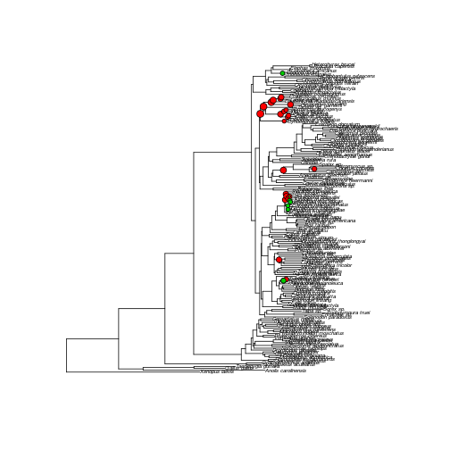
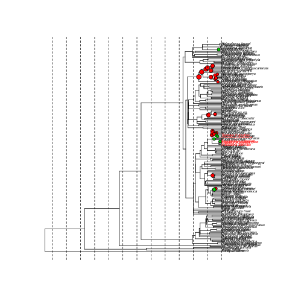
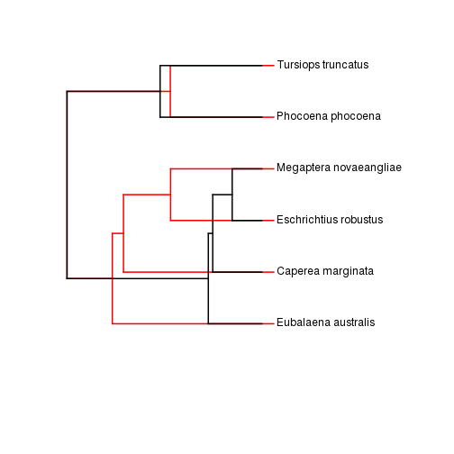

# Complete whale analysis workflow:

## Part 1. Load required libraries and functions


```r
require(devtools)
#install_github("rotl", user="fmichonneau")
require(rotl)
require(rjson)
require(geiger)
```

## Load required input files
The file CetaceanCompData.csv contains a list of taxa for which we have compartive data.

```r
table <- read.csv("../data/CetaceanCompData.csv")
head(table)
```

```
##   X   Order          Family         Genus      Species
## 1 1 Cetacea       Ziphiidae    Mesoplodon   ginkgodens
## 2 2 Cetacea       Ziphiidae    Mesoplodon     bowdoini
## 3 3 Cetacea Balaenopteridae  Balaenoptera     borealis
## 4 4 Cetacea     Delphinidae Peponocephala      electra
## 5 5 Cetacea Balaenopteridae     Megaptera novaeangliae
## 6 6 Cetacea       Ziphiidae    Mesoplodon   stejnegeri
##                  genspec ActivityCycle   Mass.g Forearm.mm BodyLen.mm
## 1  Mesoplodon_ginkgodens            NA  1500000         NA       4880
## 2    Mesoplodon_bowdoini            NA  2600000         NA       4265
## 3  Balaenoptera_borealis            NA 22100000         NA      16494
## 4  Peponocephala_electra            NA   206000         NA         NA
## 5 Megaptera_novaeangliae            NA 30000000         NA      12876
## 6  Mesoplodon_stejnegeri            NA  4800000         NA       6090
##   AgeatFirstBirth BasalMetRate.mL02hr BasalMetRateMass.g DietBreadth
## 1              NA                  NA                 NA          NA
## 2              NA                  NA                 NA          NA
## 3              NA                  NA                 NA           2
## 4              NA                  NA                 NA          NA
## 5              NA                  NA                 NA           2
## 6              NA                  NA                 NA          NA
##   DispersalAge GestationLen HabitatBreadth MaxLongevity.m
## 1           NA           NA              1             NA
## 2           NA           NA              1             NA
## 3           NA        334.6              1            888
## 4           NA        365.0              1            564
## 5           NA        349.8              1           1140
## 6           NA           NA              1             NA
##   SexualMaturityAge.d TeatNumber Terrestriality TrophicLevel
## 1                  NA         NA             NA           NA
## 2                  NA         NA             NA           NA
## 3                2854         NA             NA            3
## 4                3216         NA             NA           NA
## 5                1172         NA             NA            3
## 6                  NA         NA             NA           NA
##                                                           References
## 1                                                     1217;2151;2655
## 2                                                      165;2151;2655
## 3                               511;543;899;1004;1217;1297;2151;2655
## 4                                                 543;1297;2151;2655
## 5 24;68;159;162;163;179;490;491;505;543;899;1004;1297;1577;2151;2655
## 6                                                     1217;2151;2655
##   Mass.g.EXT Area.km2 MaxLat.dd MinLat.dd MRLat.dd MaxLong.dd MinLong.dd
## 1         NA       NA        NA        NA       NA         NA         NA
## 2         NA       NA        NA        NA       NA         NA         NA
## 3         NA       NA        NA        NA       NA         NA         NA
## 4         NA       NA        NA        NA       NA         NA         NA
## 5         NA       NA        NA        NA       NA         NA         NA
## 6         NA       NA        NA        NA       NA         NA         NA
##   MRLong.dd PrecipMean.mm TempMean.C AETMean.mm PETMean.mm
## 1        NA            NA         NA         NA         NA
## 2        NA            NA         NA         NA         NA
## 3        NA            NA         NA         NA         NA
## 4        NA            NA         NA         NA         NA
## 5        NA            NA         NA         NA         NA
## 6        NA            NA         NA         NA         NA
```

## Download source trees from the Open Tree of Life database.
Generate a list of taxa for which we have comparive data.

```r
taxalist <- table$genspec
taxalist
```

```
##  [1] Mesoplodon_ginkgodens      Mesoplodon_bowdoini       
##  [3] Balaenoptera_borealis      Peponocephala_electra     
##  [5] Megaptera_novaeangliae     Mesoplodon_stejnegeri     
##  [7] Stenella_coeruleoalba      Lissodelphis_borealis     
##  [9] Lagenorhynchus_acutus      Lagenorhynchus_obliquidens
## [11] Cephalorhynchus_heavisidii Balaenoptera_acutorostrata
## [13] Phocoenoides_dalli         Orcaella_brevirostris     
## [15] Globicephala_macrorhynchus Phocoena_phocoena         
## [17] Eubalaena_australis        Eschrichtius_robustus     
## [19] Balaenoptera_physalus      Pseudorca_crassidens      
## [21] Delphinus_delphis          Berardius_bairdii         
## [23] Tursiops_truncatus         Eubalaena_glacialis       
## [25] Grampus_griseus            Mesoplodon_hectori        
## [27] Caperea_marginata          Balaena_mysticetus        
## [29] Steno_bredanensis          Indopacetus_pacificus     
## 30 Levels: Balaena_mysticetus ... Tursiops_truncatus
```

Query OpenTree api for taxonomic name resolution

```r
tax <- rotl::tnrs_match_names(taxalist)
head(tax)
```

```
##            search_string
## 1  mesoplodon_ginkgodens
## 2    mesoplodon_bowdoini
## 3  balaenoptera_borealis
## 4  peponocephala_electra
## 5 megaptera_novaeangliae
## 6  mesoplodon_stejnegeri
##                                                       unique_name
## 1 Mesoplodon ginkgodens (species ncbi:272214 in family Ziphiidae)
## 2    Mesoplodon bowdoini (species ncbi:74393 in family Ziphiidae)
## 3                                           Balaenoptera borealis
## 4                                           Peponocephala electra
## 5                                          Megaptera novaeangliae
## 6  Mesoplodon stejnegeri (species ncbi:52114 in family Ziphiidae)
##   approximate_match  ott_id number_matches is_synonym is_deprecated
## 1              TRUE  654357              3      FALSE         FALSE
## 2              TRUE 1021373              3      FALSE         FALSE
## 3              TRUE  800329              2      FALSE         FALSE
## 4              TRUE  336234              1      FALSE         FALSE
## 5              TRUE  226198              2      FALSE         FALSE
## 6              TRUE  319467              2      FALSE         FALSE
```

Get ottIDs for the comparative data.

```r
ottids <- as.character(tax$ott_id) 
```

Find all source trees with our focal taxa in them, filter out trees without branch lengths. 

```r
studyTrees <- findsourcetrees(ottids)      
possibleTrees <- getStudyTrees(studyTrees)
possibleTrees$summary
```

```
##               ntips matching timeUnits description                 mode
## 1927_tree6215    87       30       Myr                          ot:time
## 1428_tree2855   169        6                       ot:substitutionCount
```

We are going to choose study 1428 and tree2855. Under normal circumstances, you would choose 1927, because
it is a timetree with all of our taxa. However, to test our method, we are going to use a more poorly matching
tree, to demonstrate how we could match under non-ideal conditions.

```r
tree <- extractTree(2, possibleTrees)
plot(tree)
```

 

We'll also grab the other tree to validate our tree later.

```r
reference_tree <- extractTree(1, possibleTrees)
```

## Now we will search the OT study database for trees calibrated in time units that shares taxa with our focal tree.

```r
stcal <- sourceTreeCalibrations(tree, taxalist)
```

```
## Warning: Loxodonta africanus are not matched
## Warning: NAs introduced by coercion
```

```r
stcal$summary
```

```
##               ntips matching timeUnits description    mode
## 1646_tree6233    36        3       Myr             ot:time
## 1969_tree4022   154        3       Myr             ot:time
## 1927_tree6215    87        7       Myr             ot:time
## 2656_tree6186   372       15       Myr             ot:time
## 2688_tree6240  2260       31       Myr             ot:time
## 2859_tree6643   305        6       Myr             ot:time
```

Get calibrations from other time calibrated timetrees. 

```r
target <- drop.tip(tree, "Danio_rerio")
ot_calibrations <- getSourceTreeCalibrations(stcal)
head(ot_calibrations)
```

```
##                                              MRCA MaxAge MinAge
## 1646_tree6233.54 48cfa538890e4a58d93a70152130eddc  25.70  25.70
## 1646_tree6233.55 072ffb22b7264a4e36ece5f29e01b248  20.70  20.70
## 1969_tree4022    fe90491b28df3a6c054d8022f5fede67  31.31  31.31
## 1927_tree6215.93 bac66af110ccae5fe4d16ac6b54a7ff7  33.80  33.80
## 1927_tree6215.95 6cbaf10ddd3c975aa63d3572a894fdc4  32.39  32.39
## 1927_tree6215.96 b6e1406e3b4d429a9f9202e11d9260eb  31.62  31.62
##                                  taxonA                 taxonB
## 1646_tree6233.54         Phoca_vitulina Arctocephalus_forsteri
## 1646_tree6233.55 Arctocephalus_forsteri      Odobenus_rosmarus
## 1969_tree4022       Thyroptera_tricolor  Mystacina_tuberculata
## 1927_tree6215.93        Kogia_breviceps      Phocoena_phocoena
## 1927_tree6215.95      Phocoena_phocoena   Platanista_gangetica
## 1927_tree6215.96      Phocoena_phocoena      Mesoplodon_bidens
```

Get fossil calibration data for our study group.

```r
# Get the data (tree, occurrences)
names="cetacea"
pbdb.data<-pbdb_occurrences(limit="all",base_name=names,vocab="pbdb",show=c("phylo", "time", "ident"))
# Get genus + age related info
g <- getGenera(tree,pbdb.data)
# Assign calibrations to each node
fossil_calibrations<-getCalibrations(g)
```

```
## Warning: no non-missing arguments to max; returning -Inf
## Warning: no non-missing arguments to max; returning -Inf
## Warning: no non-missing arguments to max; returning -Inf
## Warning: no non-missing arguments to max; returning -Inf
## Warning: no non-missing arguments to max; returning -Inf
## Warning: no non-missing arguments to max; returning -Inf
## Warning: no non-missing arguments to max; returning -Inf
## Warning: no non-missing arguments to max; returning -Inf
## Warning: no non-missing arguments to max; returning -Inf
## Warning: no non-missing arguments to max; returning -Inf
## Warning: no non-missing arguments to max; returning -Inf
## Warning: no non-missing arguments to max; returning -Inf
## Warning: no non-missing arguments to max; returning -Inf
## Warning: no non-missing arguments to max; returning -Inf
## Warning: no non-missing arguments to max; returning -Inf
## Warning: no non-missing arguments to max; returning -Inf
## Warning: no non-missing arguments to max; returning -Inf
## Warning: no non-missing arguments to max; returning -Inf
## Warning: no non-missing arguments to max; returning -Inf
## Warning: no non-missing arguments to max; returning -Inf
## Warning: no non-missing arguments to max; returning -Inf
## Warning: no non-missing arguments to max; returning -Inf
## Warning: no non-missing arguments to max; returning -Inf
## Warning: no non-missing arguments to max; returning -Inf
## Warning: no non-missing arguments to max; returning -Inf
## Warning: no non-missing arguments to max; returning -Inf
## Warning: no non-missing arguments to max; returning -Inf
## Warning: no non-missing arguments to max; returning -Inf
## Warning: no non-missing arguments to max; returning -Inf
## Warning: no non-missing arguments to max; returning -Inf
## Warning: no non-missing arguments to max; returning -Inf
## Warning: no non-missing arguments to max; returning -Inf
## Warning: no non-missing arguments to max; returning -Inf
## Warning: no non-missing arguments to max; returning -Inf
## Warning: no non-missing arguments to max; returning -Inf
## Warning: no non-missing arguments to max; returning -Inf
## Warning: no non-missing arguments to max; returning -Inf
## Warning: no non-missing arguments to max; returning -Inf
## Warning: no non-missing arguments to max; returning -Inf
## Warning: no non-missing arguments to max; returning -Inf
## Warning: no non-missing arguments to max; returning -Inf
## Warning: no non-missing arguments to max; returning -Inf
## Warning: no non-missing arguments to max; returning -Inf
## Warning: no non-missing arguments to max; returning -Inf
## Warning: no non-missing arguments to max; returning -Inf
## Warning: no non-missing arguments to max; returning -Inf
## Warning: no non-missing arguments to max; returning -Inf
## Warning: no non-missing arguments to max; returning -Inf
## Warning: no non-missing arguments to max; returning -Inf
## Warning: no non-missing arguments to max; returning -Inf
## Warning: no non-missing arguments to max; returning -Inf
## Warning: no non-missing arguments to max; returning -Inf
## Warning: no non-missing arguments to max; returning -Inf
## Warning: no non-missing arguments to max; returning -Inf
## Warning: no non-missing arguments to max; returning -Inf
## Warning: no non-missing arguments to max; returning -Inf
## Warning: no non-missing arguments to max; returning -Inf
## Warning: no non-missing arguments to max; returning -Inf
## Warning: no non-missing arguments to max; returning -Inf
## Warning: no non-missing arguments to max; returning -Inf
## Warning: no non-missing arguments to max; returning -Inf
## Warning: no non-missing arguments to max; returning -Inf
## Warning: no non-missing arguments to max; returning -Inf
## Warning: no non-missing arguments to max; returning -Inf
## Warning: no non-missing arguments to max; returning -Inf
## Warning: no non-missing arguments to max; returning -Inf
## Warning: no non-missing arguments to max; returning -Inf
## Warning: no non-missing arguments to max; returning -Inf
## Warning: no non-missing arguments to max; returning -Inf
## Warning: no non-missing arguments to max; returning -Inf
## Warning: no non-missing arguments to max; returning -Inf
## Warning: no non-missing arguments to max; returning -Inf
## Warning: no non-missing arguments to max; returning -Inf
## Warning: no non-missing arguments to max; returning -Inf
## Warning: no non-missing arguments to max; returning -Inf
## Warning: no non-missing arguments to max; returning -Inf
## Warning: no non-missing arguments to max; returning -Inf
## Warning: no non-missing arguments to max; returning -Inf
## Warning: no non-missing arguments to max; returning -Inf
## Warning: no non-missing arguments to max; returning -Inf
## Warning: no non-missing arguments to max; returning -Inf
## Warning: no non-missing arguments to max; returning -Inf
## Warning: no non-missing arguments to max; returning -Inf
## Warning: no non-missing arguments to max; returning -Inf
## Warning: no non-missing arguments to max; returning -Inf
## Warning: no non-missing arguments to max; returning -Inf
## Warning: no non-missing arguments to max; returning -Inf
## Warning: no non-missing arguments to max; returning -Inf
## Warning: no non-missing arguments to max; returning -Inf
## Warning: no non-missing arguments to max; returning -Inf
## Warning: no non-missing arguments to max; returning -Inf
## Warning: no non-missing arguments to max; returning -Inf
## Warning: no non-missing arguments to max; returning -Inf
## Warning: no non-missing arguments to max; returning -Inf
## Warning: no non-missing arguments to max; returning -Inf
## Warning: no non-missing arguments to max; returning -Inf
## Warning: no non-missing arguments to max; returning -Inf
## Warning: no non-missing arguments to max; returning -Inf
## Warning: no non-missing arguments to max; returning -Inf
## Warning: no non-missing arguments to max; returning -Inf
## Warning: no non-missing arguments to max; returning -Inf
## Warning: no non-missing arguments to max; returning -Inf
## Warning: no non-missing arguments to max; returning -Inf
## Warning: no non-missing arguments to max; returning -Inf
## Warning: no non-missing arguments to max; returning -Inf
## Warning: no non-missing arguments to max; returning -Inf
## Warning: no non-missing arguments to max; returning -Inf
## Warning: no non-missing arguments to max; returning -Inf
## Warning: no non-missing arguments to max; returning -Inf
## Warning: no non-missing arguments to max; returning -Inf
## Warning: no non-missing arguments to max; returning -Inf
## Warning: no non-missing arguments to max; returning -Inf
## Warning: no non-missing arguments to max; returning -Inf
## Warning: no non-missing arguments to max; returning -Inf
## Warning: no non-missing arguments to max; returning -Inf
## Warning: no non-missing arguments to max; returning -Inf
## Warning: no non-missing arguments to max; returning -Inf
## Warning: no non-missing arguments to max; returning -Inf
## Warning: no non-missing arguments to max; returning -Inf
## Warning: no non-missing arguments to max; returning -Inf
## Warning: no non-missing arguments to max; returning -Inf
## Warning: no non-missing arguments to max; returning -Inf
## Warning: no non-missing arguments to max; returning -Inf
## Warning: no non-missing arguments to max; returning -Inf
## Warning: no non-missing arguments to max; returning -Inf
## Warning: no non-missing arguments to max; returning -Inf
## Warning: no non-missing arguments to max; returning -Inf
## Warning: no non-missing arguments to max; returning -Inf
## Warning: no non-missing arguments to max; returning -Inf
## Warning: no non-missing arguments to max; returning -Inf
```

```r
# Removed nested calibrations
fixed.constraints<-filter.constraints(fossil_calibrations,tree)
# Assignning daughter nodes to calibrated parent nodes
calibrated.nodes<-fill.daughters(fixed.constraints,tree) 
```

Combine calibrations into a single table

```r
ot_calibrations$source <- rownames(ot_calibrations)
calibrated.nodes <- cbind(calibrated.nodes[,c(1,2,2, 5:6)])
calibrated.nodes$source <- "PBDB"
colnames(calibrated.nodes) <- colnames(ot_calibrations)
calibrations <- rbind(ot_calibrations, calibrated.nodes)
head(calibrations)
```

```
##                                              MRCA MaxAge MinAge
## 1646_tree6233.54 48cfa538890e4a58d93a70152130eddc  25.70  25.70
## 1646_tree6233.55 072ffb22b7264a4e36ece5f29e01b248  20.70  20.70
## 1969_tree4022    fe90491b28df3a6c054d8022f5fede67  31.31  31.31
## 1927_tree6215.93 bac66af110ccae5fe4d16ac6b54a7ff7  33.80  33.80
## 1927_tree6215.95 6cbaf10ddd3c975aa63d3572a894fdc4  32.39  32.39
## 1927_tree6215.96 b6e1406e3b4d429a9f9202e11d9260eb  31.62  31.62
##                                  taxonA                 taxonB
## 1646_tree6233.54         Phoca_vitulina Arctocephalus_forsteri
## 1646_tree6233.55 Arctocephalus_forsteri      Odobenus_rosmarus
## 1969_tree4022       Thyroptera_tricolor  Mystacina_tuberculata
## 1927_tree6215.93        Kogia_breviceps      Phocoena_phocoena
## 1927_tree6215.95      Phocoena_phocoena   Platanista_gangetica
## 1927_tree6215.96      Phocoena_phocoena      Mesoplodon_bidens
##                            source
## 1646_tree6233.54 1646_tree6233.54
## 1646_tree6233.55 1646_tree6233.55
## 1969_tree4022       1969_tree4022
## 1927_tree6215.93 1927_tree6215.93
## 1927_tree6215.95 1927_tree6215.95
## 1927_tree6215.96 1927_tree6215.96
```

Plot results

```r
plot(target, cex=0.5)
nn <- sapply(1:nrow(calibrations), function(x) getMRCA(target, as.character(calibrations[x,4:5])))
nodelabels(node = nn, pch=21, bg=ifelse(calibrations$source=="PBDB", 3, 2), cex=log(calibrations$MaxAge)/3)
```

 

Use pathd8 to get results. 

```r
tr <- replaceHashes(target, calibrations)
phypd8 <- PATHd8.phylo(tr$scion, tr$table[1:23,], base = ".tmp_PATHd8", rm = FALSE)
```

Plot time calibrated phylogeny

```r
plot.phylo(phypd8, cex=0.5, tip.color = (phypd8$tip.label %in% taxalist)+1)
nodelabels(node = nn, pch=21, bg=ifelse(calibrations$source=="PBDB", 3, 2), cex=log(calibrations$MaxAge)/3)
#Vertical lines indicating 50 my intervals
ageMax <- max(nodeHeights(phypd8))
abline(v=ageMax - seq(0,ageMax, 50), lty=2)
```

 

Compare final tree to results of known timetree. 

```r
compTimeTree <- drop.tip(phypd8, phypd8$tip.label[!(phypd8$tip.label %in% taxalist)])
refTimeTree <- drop.tip(reference_tree, reference_tree$tip.label[!(reference_tree$tip.label %in% compTimeTree$tip.label)])
compTimeTree <- reorder(compTimeTree,"cladewise")
refTimeTree <- reorder(refTimeTree,"cladewise")
plot(c(0,0), c(0, 0), type="n", xlim=c(0, 60), ylim=c(0, 6), xaxt="n", yaxt="n",xlab="", ylab="", bty="n")
plotTree(refTimeTree, add=TRUE, color="red")
plotTree(compTimeTree, add=TRUE, ftype="off",lty=2, offset=c(max(nH2)-max(nH1),1))
```

 


